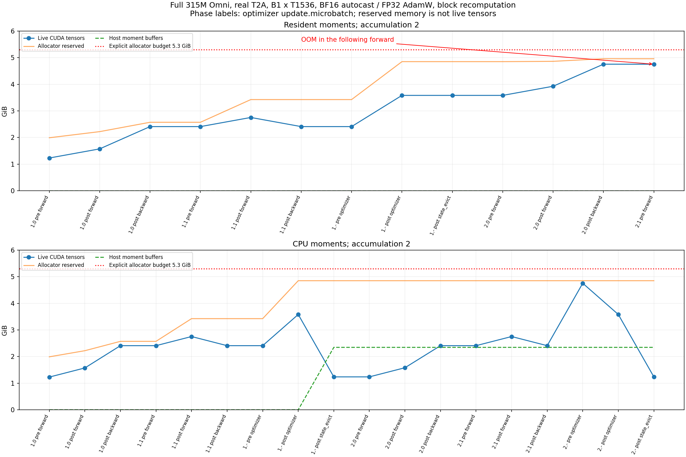

# 315M Omni 的 OOM：碎片、activation 与累积梯度

2026-10-03。本机 RTX 4060 Laptop，完整官方 **314,887,938** 参数，FP32 参数/AdamW、BF16 autocast。T2A 输入不调用语音/视觉输入编码器；这不是删除模型模态，也不能据此宣布 A2A/I2T 已通过。

## 边界怎么定义

Windows 当时占用约2GiB显存。本测试给 PyTorch allocator 设定 **5.3GiB** 上限，给桌面、CUDA context 和波动留空间，避免 WDDM 大量换页拖垮整机。以下 OOM 是这个明确预算内的 OOM，不是声称“把所有其他程序关掉，物理8GB也绝不可能”。原始 traceback 中的 free memory、allowed、allocated、reserved 同时保留。

参数约1.173GiB，gradient 同量，AdamW 的 m/v 合计约2.346GiB，训练状态总计约 **4.69GiB**。输入编码器、activation、RoPE buffer、音频8路logits和临时张量还要另算。

| 测试 | 现象 | allocated / reserved 证据 | 结论 |
|---|---|---|---|
| B1,T512，默认 allocator | 第一次 AdamW 分配 moment 时 OOM | 4.15GiB 活跃，约1.14GiB保留未活跃；申请20MiB失败 | 不能简单归因于所有张量总和超限；需要验证碎片假设 |
| 相同 B1,T512，expandable segments | 连续3次更新通过 | peak allocated约4.81GiB，peak reserved约5.13GiB | 支持默认分配布局/碎片是第一种失败关键因素的解释 |
| B1,T1536，expandable segments | 再次 OOM | 5.26GiB 活跃，仅约39MiB保留未活跃 | 此时主要是活跃张量占满预算，继续只调 allocator 不够 |
| B1,T1536，expandable segments＋block 重计算 | 连续3次更新通过 | peak allocated约4.89GiB，peak reserved约5.04GiB | 在同一预算中保留完整模型和长度，通过工程重计算减少保存的 activation |

## 修复有没有改变训练算法

`expandable_segments:True` 改内存分配策略，不改网络、loss、batch 或 optimizer。激活重计算在 backward 重新执行 block，以计算换显存；使用 PyTorch non-reentrant checkpoint，并保存 dropout RNG。

我们没有只看“不报错”。`tests/test_checkpointing.py` 比较普通 MoE 的 CE＋aux、dropout 和全部参数梯度；`tests/test_omni_contract.py` 进一步比较 Thinker 的中间 bridge 同时进入文本与 Talker 两条损失路径时的全部梯度。两项都通过，state_dict 键也不变。小维度仅用于数学合同测试，显存测试始终是完整315M。

重计算实现位于 `lab/checkpointing.py`，运行时包装 block.forward，官方 checkout 未修改。CPU 梯度对照证明这些测试条件下的等价性；GPU 不同调度仍可能出现浮点舍入差异，不能承诺所有训练都逐位确定。

## 代价与下一步

重计算增加 forward 工作量。本次1536长度重计算的后两步约0.35～0.36秒/步，但未重计算的相同长度失败，不能由不同长度的时间推算“只慢了多少百分比”。测试使用固定合成 tokens，无真实多模态加载/解码开销。

尚未验证：带 SenseVoice/SigLIP 的 A2A/I2T、真实变长音频/图像数据、冻结 encoder 的 CPU/缓存策略、长时间训练与质量。只有这些证据充分后才能决定 Omni 最终本机或服务器。现在已有证据说明完整315M的 T2A 并非必须上服务器。

## 日后快速诊断

先定位 OOM 发生在 forward、backward 还是第一次 optimizer.step。若 reserved 明显大于 allocated，先检查分配布局及活跃引用；若 allocated 本身接近预算，分析 state 与 activation，占用不会因简单 empty_cache 消失。至少跑完第二次更新，因为 AdamW 状态第一次 step 后才常驻。保持同一模型、同一输入、同一预算做对照，再归因。

原始结果在 `models/03_omni_moe/runs/t2a_memory_*`；对应日志为 `logs/omni_memory_*.log`，梯度合同日志为 `logs/checkpointing_gradient_contract.log` 和 `logs/omni_checkpointing_gradient_contract.log`。失败实验未删除。

## 第三次：真实数据、梯度累积与第二次更新

随后真实T2A采用B1、长度1536、累积2、相同5.3GiB预算与重计算。第1次更新成功，第2次更新forward OOM；完整GPU resume预检也在相同条件失败。原始记录为`runs/real_t2a_B1_T1536/`与`runs/trainer_gpu_resume_v1/`，不能将先前合成样本成功说成真实训练已通过。

初始假设包括：真实样本专家路由导致不同临时张量；loss或Python引用留下旧计算图；梯度累积使已有gradient与下一microbatch的activation叠加。为区分它们，保持模型、输入长度、数据与初始化不变，分别做accumulation1和2，并记录每个forward/backward/optimizer边界。

| 阶段 | 累积2且moment常驻 | 同一累积2，moment更新后卸载 |
|---|---:|---:|
| 第1次optimizer前（还未建立moment） | 2.41GiB | 2.41GiB |
| 第1次optimizer后，gradient已清空 | 3.58GiB | 3.58GiB |
| 额外卸载两份moment后 | — | 1.24GiB |
| 第2次更新第1个microbatch backward后 | 4.76GiB | 2.41GiB |
| 第2个microbatch forward | OOM：报错时活跃约5.24GiB | 通过；forward结束约2.75GiB |
| 参数更新前搬回moment | 已常驻 | 4.76GiB |

累积1连续3次通过；累积2再次在第二个microbatch失败。只有约50MiB reserved-but-unused，不能再把主因归为碎片。第一步成功是因为AdamW在第一次optimizer.step才建立m/v；只有进入后续更新并保留前一microbatch的gradient，才出现这组高峰。Python已在每个backward后删除loss结果，不是把24份完整图累在列表里。

## moment卸载：什么改变了，什么代价

`lab/optimizer_offload.py`把FP32 m/v复制到持久pinned CPU buffer，只在`optimizer.step`前搬回CUDA；参数、gradient、AdamW数学运算仍在GPU。实际host moment为2,519,103,504字节，约2.35GiB。没有改变网络、batch、累积、loss、LR或moment dtype；也没有将“AdamW在CPU计算”混同为这种存储策略。

小型CUDA对照进行了6次更新，每次3个累积microbatch，并在中途保存/恢复：与完全驻留GPU的AdamW相比，每次参数与全部optimizer状态逐位相同。完整315M真实T2A随后完成连续5步 vs 第1步保存后恢复的对照，使用dropout0.1、两个DataLoader worker、重计算、跨epoch；最终模型、optimizer、cursor、token计数、CPU/CUDA RNG和最佳验证分数全部逐位一致。分别见`runs/adam_offload_contract_v1/`和`runs/trainer_gpu_resume_v2_offload/result.json`。这些是系统正确性证据，不是训练质量结论。

代价是每次更新约5.04GB双向传输、额外2.35GiB主存。本机短测的稳态restore＋evict约0.5秒；首次申请pinned buffer可能数秒，不能当成稳态。真实B1×1536、累积2的稳态更新约1.08秒/2条记录。WSL只有约7.6GiB RAM，必须同时考虑输入encoder、worker与保存时的RAM峰值。

当前验证证明的是**明确5.3GiB allocator预算内**可以保留完整T2A训练语义。它不是“物理8GB卡绝对只能offload”的证明。后续还需根据当时桌面/驱动占用测试略高预算是否可安全省去offload，以及offload后是否能减少重计算。A2A/I2T仍需真实输入编码器验证，不能把这次T2A通过外推到全部Omni。

## 第三轮：更高预算和真实输入编码器

以上“后续”现已执行一部分，原始命令/日志在 `runs/preflight_window_v3/`：

| 真实数据试验 | 结果 | 证据与限制 |
|---|---|---|
| T2A，L1536、累积2、重计算、无卸载，预算升至5.7GiB | OOM | audio CE期间allocated约5.64GiB，仅约56MiB保留未用；提高预算仍不足 |
| T2A，同长度/累积，moment卸载、关闭重计算、5.3GiB | 3次更新通过 | peak allocated 5,145,970,688字节；第三步约0.924秒/2样本，短测不能证明长时间峰值和吞吐 |
| A2A，L1536、累积2、重计算、moment卸载、5.7GiB，随机真实音频 | 3次更新通过 | 315M训练参数＋冻结221,136,992参数SenseVoice；audio_proj梯度非零 |
| A2A，相同设置，实际较长输入音频 | 2次更新通过 | 实际记录fbank长度668、907等；覆盖这些可保留回答的样本，不涵盖被1536截掉的最长输入 |

A2A peak allocated为6,030,519,296字节（约5.62GiB），最大阶段主要来自optimizer更新前restore moment。具体随机样本第三步1.208秒/2样本、长输入第二步1.789秒/2样本；不能用两步吞吐外推整个语料。两次均完成451条held-out前向、完整恢复点保存。冻结编码器不进optimizer，但仍占参数和临时显存；其FP32参数约0.824GiB。

系统RAM观察：WSL 7.6GiB内存、2GiB swap下，pinned moment约2.35GiB，A2A测试期间available最低观测约269MiB、swap约1.2～1.5GiB。完成GPU更新只是一个必要条件；长时间还要观测paging、数据加载和checkpoint峰值。不能把父进程/两个worker的RSS直接相加当独占RAM，因为它们包含共享页。

另一项独立发现是数据截断：90秒级音频增强后可产生2192个fbank帧，默认1536输入可能装不下回答。扩大到3072的同组CPU数据检查消除了所见7次零监督，接下来验证GPU；没有用删除这些问题记录的方式让测试通过。

## A2A 3072上下文：GPU通过，但主机内存余量偏小

`real_a2a_long_L3072_v2` 完整315M模型加221M冻结SenseVoice、B1/累积2/激活重计算/moment暂存，两次真实长音频更新和451条完整验证均完成。四次训练读取没有零标签或缺STOP；全验证的8个codebook各有451个STOP标签。第二次更新3.368秒处理2条，CUDA峰值6,030,519,296字节。只是短测，不代表语音质量。

`host.jsonl`每2秒监测WSL：可用RAM最低177,901,568字节（约170MiB），swap最高约1.65GiB，监测窗口全系统额外换出约701MiB。父进程RSS最高约5.78GiB；RSS含共享/映射，不能把所有分页都归因于该进程。完整统计在 `reports/omni_a2a_L3072_host_v2.json`。同时Windows只剩约1.03GiB空闲物理内存，不能简单给WSL再分数GB就当解决。

结论是显存可执行、长运行RAM余量不足；后续应比较减少预取/缓存或使用服务器的实际收益。当前没有缩小模型，也没有终止其他应用。A2A是否放服务器以持续资源证据决定，短测成功不等于本机数天运行一定稳定。

后续worker1/prefetch1复测已完成32次随机更新和451条验证，GPU峰值仍5.62GiB、稳态1.40样本/s；最低可用RAM296.92MiB，监测期间新增换出594.64MiB，最低点在最终验证。T2A B2/累积8也完成12更新+1266验证，4.30样本/s、allocated4.79GiB、最低可用RAM956.95MiB。完整原始记录与限制见 `reports/preflight_window_v6c_review.md`。下一项为同一A2A条件的worker0对照；尚未据此缩小模型或自动改用服务器。
