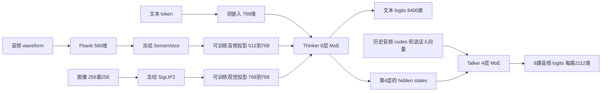

# 第三课：Omni 的数据、对齐与多目标损失

对应固定版本 `sources/minimind-o/` 的真实实现。当前已验证完整315M真实T2A更新/恢复、真实A2A短程更新、I2T全参数与视觉投影更新。这些是正式训练准备，不代表模型已学会多模态任务。完整阶段以同commit的train.sh full MoE七阶段建议为来源，包含视觉全参数后的语音回训与视觉再对齐，详见recipe_decisions纠错。

## 三类输入如何进入同一语言主干



音频、图像特征在特殊占位token处替换词嵌入，再进入Thinker。它们不是把识别出的文字简单拼到prompt里。Talker读取的是Thinker中间层的语义状态，文本损失和音频损失可以共同影响较早的Thinker层。

## 必须分清的 shape 与 token 空间

| 数据 | shape或含义 | 源码 |
|---|---|---|
| 原始文本 | tokenizer后`[B,T]`，词表6400 | `dataset/omni_dataset.py` |
| 训练时组合输入 | `[B,9,T]`，前8路音频codes，第9路文本 | `OmniDataset.__getitem__` |
| Fbank | `[B,F,560]`，F为变长音频特征帧数 | `SenseVoiceAudioProcessor` |
| 音频encoder输出 | 每个有效样本`[F,512]`，投影后`[F,768]` | `encode_audio_inputs` |
| 图像输入 | `[B,3,256,256]`；单张图像64个patch输出 | `load_image_inputs`、`encode_image_inputs` |
| speaker embedding | `[B,192]`，投影到Talker hidden维 | `TalkerModule.spk_proj` |
| 文本logits | `[B,T,6400]` | `MiniMindOmni.forward` |
| 音频logits | 长度8的list，每项`[B,T,2112]` | `TalkerHead` |

语言词表里的音频占位符ID是16，图像占位符ID是12；音频code空间里PAD是2049、STOP是2050、speaker占位是2051。不同词表的数值不能互换。Mimi的8路离散code共同表示音频，不能把任意一条code流当成单独的完整声音。

## 为什么8路音频不是同一位置直接复制

数据先构造完整文本序列和8路目标序列，音频第i路相对assistant开始位置延迟`i+1`。然后取输入`[:-1]`、labels`[1:]`。这样较后codebook可以利用较前codebook已经出现的历史条件。

这里和AR主线有一个容易犯的区别：**Omni Dataset已经shift了labels，Omni模型forward没有再次shift。** AR主线Dataset不shift，由`MiniMindForCausalLM.forward`内部shift。把两份训练器机械拼在一起会出现双重shift，使训练目标错位，却仍可能输出有限loss。

## 实际优化目标

官方trainer对文本有效标签计算平均CE；对每个音频通道各自计算平均CE，再对8路平均。STOP位置的音频CE乘10，分母仍是有效位置数量，不是加权后的权重和。最后加Thinker与Talker所有MoE层的aux。

```
L_text = sum(valid_text * CE_text) / count(valid_text)
L_audio_i = sum(valid_i * (1 + 9 * is_STOP) * CE_i) / count(valid_i)
L = L_text + (sum_i L_audio_i) / 8 + L_aux
```

空通道贡献0，实际代码对分母加很小的数以避免除零。不能直接把文本和8路音频所有token合并求一个均值，那会改变模态权重；也不能直接换成默认加权CrossEntropy的mean而不核对分母。

## 冻结与断梯度是两回事

SenseVoice、SigLIP2、Mimi按官方设计冻结；数据集已有Mimi target codes，因此训练时不需要每步运行Mimi。T2A没有语音/视觉输入时也无需把输入编码器放到GPU，这不改变T2A目标。

冻结backbone参数只是不更新这些权重。如果正在训练其前面的audio/vision projector，梯度仍必须穿过backbone回到projector；不能为了省显存给整个backbone套`no_grad()`。重计算可以减少保存的中间张量，同时保留这条梯度链。实际测试见 `tests/test_omni_contract.py` 与 `docs/debug/004_omni_memory.md`。

新增audio projector专项测试把Thinker/Talker及输入encoder全部冻结，只打开audio_proj；通过真实占位token注入路径计算任务loss，确认projector每个参数都有非零梯度，而冻结参数没有梯度。开启重计算前后loss与projector梯度一致，原始结果见`logs/omni_gradient_contract_v2.log`。这里使用小模型和代用encoder隔离梯度链，真实SenseVoice/SigLIP另有独立CPU前向报告；后续完整315M真实A2A与I2T梯度/更新验证已通过，分别保留在对应real_a2a/real_i2t运行目录。

## 数据加载为何需要专项设计

官方`OmniDataset.__init__`把Parquet读成完整Arrow table。压缩文件大小不等于展开后的RAM占用，5GB文件不能因为小于16GB物理RAM就直接假定安全。WSL当前内存限额还只有约7.6GiB。

原实现会做随机轮次截断、音频变速/加噪、mel遮挡、提示位置变化和scheduled sampling。语音问题还可能以纯音频、纯文字或音频加文字输入。因此A2A评测必须专门检查只有音频的输入，不能始终附带转写后就宣布模型会听。

未来若采用流式读取或冻结特征缓存，要区分：读取方式变化可以是工程等价；把每轮随机增强改为一次固定增强是数据recipe变化。对齐位置、labels和投影梯度必须通过实际样本对照。

## 需要观察和防止的问题

分别记录text CE、8路audio CE、STOP损失/命中、有效文本/音频标签数、投影梯度、路由负载、音频时长和截断率。总loss下降可能只是某一个目标变容易，不能说明语音自然或视觉正确。

源码在找不到encoder时可能返回None。对于T2A这是可解释的；对于A2A/I2T则必须防止训练在缺失真实模态的情况下静默继续。另要检查截断后是否还有assistant标签、是否保留音频STOP、audio/image特征是否确实插入了占位位置，以及cache生成是否与完整forward一致。

当前实测故障是两类OOM及网络截断。真实模态GPU短训练已完成，正式模型质量仍待完整预算；官方参考的生成链另行验证，结果会记录在 `models/03_omni_moe/runs/`，不以合成tensor小测替代它们。

## 来自真实A2A的补充证据

`real_a2a_random_cap57_v1/learning/`保存实际batch：`[1,9,1535]`输入、`[1,1535]`文本labels、`[1,8,1535]`音频labels，输入fbank帧与audio marker逐样本对应。audio_proj首步裁剪后梯度范数0.314，证明该真实路径参与了任务反传；冻结SenseVoice约221M参数仍占显存。

长尾数据比较指出，长度1536会截掉部分完整回答；同组128次增强读取在3072下由7次零监督降至0，尚不表示全语料无截断。训练器原本会跳过整批无监督的microbatch；现将跳过数、零监督样本、缺STOP通道、输入marker与最大fbank长度写入每步指标，不把跳过数据隐藏在正常loss后面。

`tests/test_omni_contract.py`新增音频前缀＋speaker＋8路历史codes的cache合同：预填充后逐token输出与完整forward的文本和全部音频logits一致，冻结输入encoder只在prefill执行。此合同使用小维度隔离实现语义，实际训练保留315M。

RAM/paging记录由`tools/monitor_host_resources.py`写入新run的`host.jsonl`。host_available、swap使用与换入换出计数反映WSL整体，不能把其他后台进程的开销全部归因于训练；parent RSS也包含共享页，不能直接加上worker RSS当总独占量。

## 从teacher forcing到真正说话

训练给定正确历史codes，推理则由8路采样结果自回归推进，并按codebook索引错开、重新组帧。文字已有EOS不表示所有音频已经输出完：本次官方参考英文回答在256步时被音频预算截断。相同seed延长到512步，旧音频code前缀逐项相同，但输出由19.84秒增加到23.28秒。详细失败、采样协议、ASR限制和文件入口见[诊断009](../debug/009_omni_generation_and_audio_io.md)。
## 一个容易误判的现象：loss正常、参数变了，却没有学到当前输入

`models/03_omni_moe/learning/inactive_projector_v1/`用官方模型的小型CPU实例隔离这一机制，**不计入任何正式模型训练**。实际输入来自真实T2A记录：`[1,9,511]`，16个文本标签、216个音频输出标签，没有输入录音。冻结所有参数，仅允许audio projector更新。

源码 `sources/minimind-o/model/model_omni.py` 在aux里加入 `sum(audio_proj_parameters)*0` 等dummy项，使未使用的分支也有零gradient。因此loss仍然有限且`requires_grad=True`，`backward()`也成功；但audio projector的任务梯度最大值为0。这时不能用“有loss、有grad tensor、optimizer.step执行了”来证明音频输入适应正在学习。

实际AdamW对照（LR1e-4、weight decay0.01，观察projector的LayerNorm weight）：

| 情况 | 当前梯度 | 参数最大变化 |
|---|---:|---:|
| 无输入音频，已有零grad tensor，初始moment为0 | 0 | 1.0133e-6，来自weight decay |
| 清为`grad=None`后直接step | None | 0，PyTorch跳过该参数 |
| 用明确标注的合成目标建立moment后，再运行同一无输入音频样本 | 0 | 5.8532e-5，含历史moment影响 |

核心数学是AdamW的moment递推和解耦weight decay：`g_t=0`不意味着历史`m_t=0`，也不取消decay；`grad=None`与数值为零的gradient有不同优化器语义。第三行的前一步是刻意构造的机制实验，不冒充一次真实语音学习。

这与真实A2A recipe直接相关：全量414,024条记录中只有350,762条含输入录音；而官方Dataset即使拿到录音，`create_chat_prompt`仍有20%分支只保留用户文字。只训audio projector时，这些样本可能没有任务梯度；全参数A2A时却仍能训练语言/Talker，因此不能粗暴从所有阶段删掉它们。多条样本组成的batch也不能简单按“全批无音频”处理。

正式投影阶段需要同时观察输入marker、非零projector梯度、有效样本比例与损失，不能只看CE下降。目前保留官方增强行为；如后续采用仅含目标模态的筛选、改变20%文本分支或跳过无梯度更新，必须记录为数据/优化recipe变化，并重新核对步数、scheduler、采样权重与resume。不能把它藏成纯工程加速。

## 用实测数字识别Adam状态的显存

独立服务器环境中，完整315M、T2A B16×累积8的首步allocated峰值9.10055GiB，第二步11.44665GiB；差额2.34611GiB。两个FP32 Adam moment的理论大小为`314,887,938 × 2 × 4 / 1024³ = 2.34610GiB`，与观察差额几乎相同。第一步forward之前尚未建立moment，第二步已经常驻；“第一步能跑”因此不能证明稳态显存足够。

这里参数和梯度分别约1.173GiB，加两个moment合计约4.692GiB。峰值剩余部分包含激活、logits、反向临时量及其他buffer，不能仅凭减法把它们全部叫做activations；精确分解需要阶段采样/profiler。T2A不加载输入语音/图像编码器，A2A/I2T还必须另计真实冻结编码器及其forward开销。实际三步数值、原日志和PNG见`models/03_omni_moe/runs/server_formal_runtime_v1/`。这仍是资源检查，不是Omni已经训练成功。
