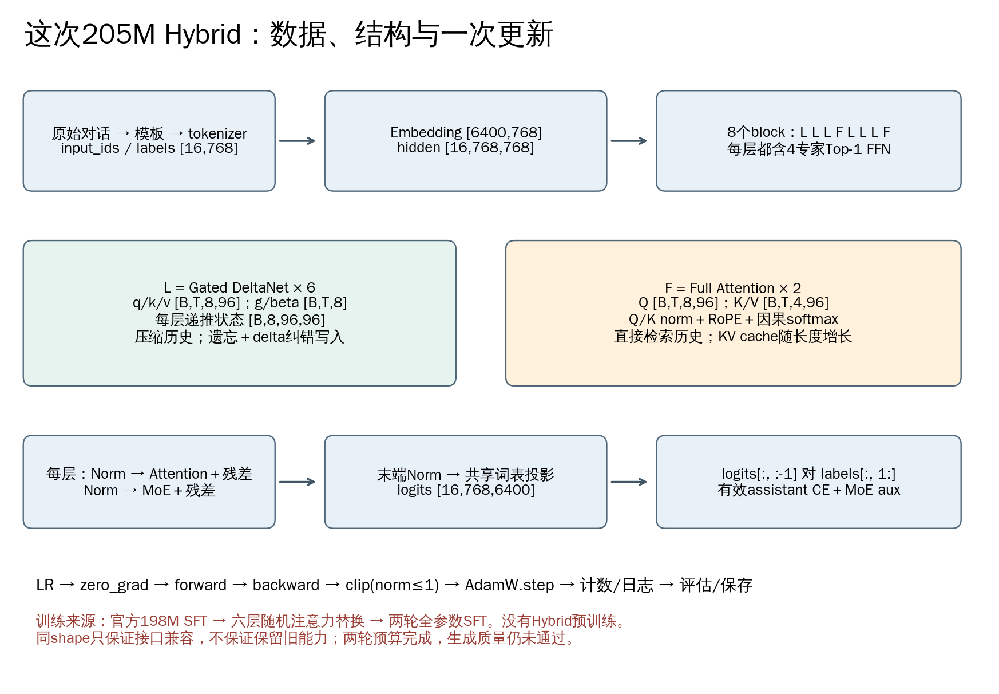

# 03 模型怎样利用前文：Full Attention、Gated DeltaNet 与 MoE

第 02 章已经把文字变成了 `[B,T]` 编号。现在我们回答：这些编号进入模型后，为什么当前位置的输出能够包含前面的话？Full、Linear、Hybrid 和 MoE 各自改变了什么？

本章先用两三个数手算，再对照完整 205M 的维度。小例子只解释机制，正式模型没有被缩小，也没有因此新增训练。

## 1. 先会读向量与矩阵，才能读模型

向量可以先理解为一列数，例如 `[2,3]`。两个同样长的向量做点积，就是对应相乘再求和：`[2,3]·[4,1]=2×4+3×1=11`。点积把一组数之间的匹配程度变成一个分数；它本身不天然代表语义，语义相关的表示要靠学习形成。

矩阵是一张数字表。线性层做“按权重把输入各分量重新组合”。若输入是 `[2,3]`，两个输出规则分别是 `x1+x2` 和 `2*x1-x2`，结果就是 `[5,1]`。模型中的投影也是这种运算，只是维度更大、组合系数由训练得到。

PyTorch 的 `Linear(in,out)` 保存的权重 shape 为 `[out,in]`，对最后一维做映射。不要把代码里的权重排列与纸上写的行/列向量混用；先核对输入输出 shape。

## 2. 从一个编号，变成一个带上下文的表示

embedding 是一张 `[6400,768]` 的参数表。每个输入编号取对应的一行，所以 `[B,T]` 变成 `[B,T,768]`。此时每个位置只是相应 token 的初始表示；经过后面的层，表示会逐渐依赖上下文。

本模型的主干是：

```text
编号 → embedding
     → 第1层 Linear Attention + MoE
     → 第2层 Linear Attention + MoE
     → 第3层 Linear Attention + MoE
     → 第4层 Full Attention   + MoE
     → 第5层 Linear Attention + MoE
     → 第6层 Linear Attention + MoE
     → 第7层 Linear Attention + MoE
     → 第8层 Full Attention   + MoE
     → RMSNorm → lm_head → 6400个候选分数
```

Linear/Full 决定怎样混合不同位置的信息；MoE 决定每个位置经过哪些 FFN 参数。这是两个不同的设计轴，因而可以组合。



## 3. 每层里的 RMSNorm 和残差分别做什么？

一层不是直接把输入全部替换掉。实际顺序是：

```python
h = x + attention(RMSNorm(x))
y = h + MoE(RMSNorm(h))
```

`x + ...` 叫残差连接：模块学习的是加在旧表示上的变化。它给信息和梯度提供直接通路，但不保证新插入的随机模块无害；只要新增项不是零，后续输入就可能改变。

RMSNorm 先计算一个位置的各分量平方的平均，再开平方，用这个尺度归一化，并乘一组可学习系数。对 `[3,4]`，忽略很小的稳定项与可学习系数：

```text
均方 = (9+16)/2 = 12.5
均方根 ≈ 3.5355
归一化结果 ≈ [0.8485, 1.1314]
```

它帮助控制数值尺度，不是在判断文本是否正确；它也不是每一层把整个 batch 混在一起统计。这里沿最后的 hidden 维度处理每个位置。源码看 `RMSNorm`、`MiniMindBlock.forward`。

## 4. Full Attention：当前问题去历史中找相关内容

一个位置会从自己的表示得到三个向量：

- **Q（query）**：当前读取内容时用什么特征进行匹配。
- **K（key）**：这个位置以什么特征被其他位置匹配。
- **V（value）**：被匹配后提供什么信息。

Q/K/V 都是线性投影学出来的数，不是程序员手写的关键词，也不对应固定的“语法头”“数学头”。

当前 Q 与各个可见 K 做点积，除以 `sqrt(head_dim)` 控制尺度，再用 softmax 把分数转换为总和为 1 的权重。最后加权组合 V：

```text
score_j = dot(q, k_j) / sqrt(d)
weight_j = exp(score_j) / sum(exp(score))
output = sum(weight_j * v_j)
```

这里 `exp(s)` 就是 e 的 s 次方，e 约为2.718；它把分数变成正数，再除以总和，得到可以加权的比例。实际计算常先给所有分数减去相同的最大值，比例不变，却能减少指数溢出。你先能算出两个权重即可，不需要先背指数函数的全部性质。

AR 模型要先排除未来位置。否则预测某个答案时，答案本身已在后面的输入中，会泄露目标。

### 4.1 手算一个有因果限制的例子

假设当前是位置 1，从 0 开始数，所以只能看位置 0 和 1：

```text
q  = [1,0]
k0 = [1,0]    v0 = [2,0]
k1 = [0,1]    v1 = [0,4]
k2 = [100,0]  v2 = [999,999]  ← 未来，不允许读取
```

可见分数为 `[1/sqrt(2),0] ≈ [0.7071,0]`。softmax 得 `[0.66976,0.33024]`，所以输出：

```text
0.66976 * [2,0] + 0.33024 * [0,4]
≈ [1.33952,1.32095]
```

即使把未来 v2 改成非常大的数，正确因果输出也不该变化。取消因果限制，本例几乎全看位置 2，输出约 `[999,999]`。这就是“能 forward、shape 对了”仍不足以证明训练正确的原因。

亲手验证：

```bash
python -B tools/lesson_examples.py attention
```

看 `causal_weights` 的第三项为 0，`future_changed_output` 与 `output` 相同。这个算术例验证可见性的含义；正式模型的数值正确性另需运行对应实现对照。

### 4.2 变成我们真实的维度

本模型 Full 层有 8 个 Q head、4 个 KV head，每头 96 维：

| 中间量 | shape | 解释 |
|---|---|---|
| 输入 x | `[B,T,768]` | 每位置 768 维 |
| Q | `[B,T,8,96]` | 8 套查询 |
| K、V | `[B,T,4,96]` | 4 套共享的键和值 |
| 注意力输出 | `[B,T,8,96]` | 各查询头读到的结果 |
| 合并与输出投影 | `[B,T,768]` | 回到残差接口 |

多个 Q 头共用较少 KV 头，叫 GQA，主要减少 K/V 参数及生成缓存。它不是让 8 个头共享全部计算。代码中的 `repeat_kv` 使共享关系能按张量形状执行。

Q/K 还经过归一化和 RoPE。RoPE 用与位置有关的旋转改变 Q/K，使点积能反映相对位置；它不是给输入多加几个 token。先理解它的功能，再读 `apply_rotary_pos_emb` 中旋转一半维度及 cos/sin 相乘的代码。

训练时可以一次并行计算整段；生成时通常保存之前位置的 K/V，叫 KV cache，避免每个新 token 都重新投影全部历史。缓存会随上下文长度增长。

Full Attention 的打分计算随长度大致有 T² 项；高效 SDPA 内核可以避免把完整打分矩阵都写入显存，因此“数学上有 T² 个关系”不等于“实际一定存了完整 T×T 矩阵”。

## 5. Gated DeltaNet：把历史更新到一份固定形状的记忆

Full Attention 可以直接重新读取许多历史 K/V。这里的 Linear 模块采用另一种机制：每读一个 token，就更新一个状态矩阵 S；当前位置从这个状态里取信息。

先用一维例子理解“遗忘、预测、纠错写入”。假设：旧状态 S=2，保留比例 α=0.5，写入强度 β=0.5，key=1，新 value=6。

```text
1. 遗忘：旧状态先乘 α，得到 1
2. 读取：状态对 key=1 的已有预测是 1
3. 差值：这次观察到6，而原来预测1，差5
4. 写入：只写入 β×5 = 2.5
5. 新状态：1+2.5 = 3.5
```

下一次还看到 value=6，若 α=β=1，就得到 `3.5+(6-3.5)=6`。如果只是把新值叠加，会得到 9.5。**Delta rule 的核心是按预测误差纠正记忆，不是不断把 value 累加。**

```bash
python -B tools/lesson_examples.py delta
```

这是一维教学特例；完整模型仍使用每头 96×96 的状态，另有投影、卷积和门。

### 5.1 把一维例子放回矩阵

用列向量书写，S 的行对应 key 维，列对应 value 维：

```text
S_decay = α_t * S_previous                 # [96,96]
prediction = S_decayᵀ * k_t                # [96]
innovation = β_t * (v_t - prediction)       # [96]
S_t = S_decay + k_t * innovationᵀ          # [96,96]，外积写入
output_t = S_tᵀ * (q_t / sqrt(96))         # [96]
```

外积的意思是“把 k 的每个数分别乘整条 innovation”，得到矩阵，而非一个点积分数。若 k=`[1,0]`、innovation=`[3,4]`，外积为 `[[3,4],[0,0]]`。

状态是**这条输入序列计算出的中间记忆**，不是 optimizer 更新的模型权重。训练不同独立样本时不会直接把上一篇对话的 S 当作下一篇开头；推理同一会话才通过 cache 接续状态。

### 5.2 α、β 怎样得到？“门”是什么意思？

门是一组根据输入算出的控制系数，不是手动 if/else。β 来自 sigmoid，控制本次纠错写入强度；α=`exp(g)`，控制旧状态保留多少。这里：

```text
β = sigmoid(in_proj_b(x))
g = -exp(A_log) * softplus(in_proj_a(x) + dt_bias)
α = exp(g)
```

g 为负，使 α 通常处于 0 与 1 之间。很强的衰减意味着旧信息很快消失，也意味着衰减相关梯度需要认真检查。前向没有 NaN 不足以证明这些门学得正确。

`sigmoid(a)=1/(1+exp(-a))` 把实数映射到0与1之间，a=0时为0.5；`softplus(a)=ln(1+exp(a))` 是平滑的正值函数。L2归一化则是向量除以自己的长度（各分量平方求和再开方），和RMSNorm先取均方的定义不同。源码加入小稳定量，避免除零。

进入状态计算前，q/k/v 还经过 kernel=4 的逐通道因果卷积和 SiLU，用来融合附近位置的信息；q/k 做 L2 归一化，控制匹配尺度。状态读出的 output 经过带输出门 z 的 RMSNorm，再投影回 768 维。z 的门控与负责遗忘的 α、负责写入的 β 是三种不同作用。

真实 q/k/v shape 均为 `[B,T,8,96]`；g、β 为 `[B,T,8]`；z 为 `[B,T,8,96]`。源码从 `GatedDeltaNet._forward` 中 `mixed_qkv` 往下读，再与上述公式逐项对应。

### 5.3 省了什么，又付出什么？

单样本单层递推状态有 `8×96×96` 个 FP32 数，约 288 KiB；本实现另留三步卷积历史，约 27 KiB。该解码状态大小不随 T 增长。但这只是推理状态，不是“整个训练只用这点显存”：训练还要保留或重算反向传播需要的中间量。

固定状态压缩历史，可能损失精细检索信息。Hybrid 每四层保留一层 Full，让网络仍有直接访问历史的路径。这是结构上的理由，不是“一定比 Full 强”的保证。

这里的“Linear”主要指固定头维度时，对序列长度 T 的计算增长趋势：递推每来一个位置做一次状态更新，核心量级随 T 增长；Full 打分要处理位置两两关系，核心量级随 T² 增长。Linear 不等于没有非线性，也不是单独一个 `nn.Linear` 层。状态矩阵更新、门、投影、反向和内核常数都要花时间，所以短序列下不保证更快。

训练用 FLA chunk 算子并行处理，解码用递推；两种执行方式应在预设数值容差内一致，检查包含输出、状态和梯度。不能拿某次短测试通过保证任意长度、padding 策略都正确。

本仓库实现是 Gated DeltaNet；每头一个衰减值。不能因为排列像某个前沿模型，就把它叫成同一模型或宣称算法细节相同。

## 6. MoE：每个位置选哪套 FFN 来处理

Attention 解决不同位置的信息交流，FFN 则对每个位置的表示进一步做非线性变换。Dense 在各位置使用同一套 FFN；这里存四套 FFN，称四个专家，由 router 为每个 token 选一个。

例如 router 对四个专家给概率 `[0.1,0.6,0.2,0.1]`，Top-1 选下标 1 的专家。它不一定是人类命名的“数学专家”；专家功能来自训练中的分工，不能仅凭编号猜。

真实流程：`[B,T,768]` 展平成 `[B*T,768]`，router 生成 `[B*T,4]` 分数，softmax 后选择专家，把分配给同一专家的 token 取出来计算，最后放回原位置。

每个专家使用 SwiGLU：

```text
gate = SiLU(gate_proj(x))       # 768 → 2432
value = up_proj(x)             # 768 → 2432
out = down_proj(gate * value)  # 2432 → 768
```

这里 `*` 是对应位置逐元素相乘，不是点积。`SiLU(u)=u*sigmoid(u)` 为通路引入非线性；如果一串无偏置线性层之间没有非线性，整体仍可合并成一个线性映射，不能仅靠叠线性层增加这种表达能力。

这是一种 FFN 内部的门控，与 GDN 的遗忘门不同。每个专家的三个大矩阵约有 `3×768×2432` 个参数。四套专家都需要存储参数和优化器状态，即使一个 token 只经过一个。一批不同 token 可能访问全部专家。

所以我们是 **FFN MoE**，注意力没有专家路由；总参数 205M 不等于每个 token 的计算都使用了全部 205M 参数。

## 7. 为什么 router 需要辅助损失？为什么修过它？

如果几乎所有 token 都只选一个专家，其他专家可能得不到充分训练，算力分配也可能不理想。本实现用负载均衡辅助损失，引导分配。

设 f_i 是硬选择到专家 i 的比例，p_i 是平均路由概率，E=4，α=0.0005，单层为：

```text
aux = α × E × sum(f_i × p_i)
```

完全均衡时 f_i=p_i=1/4，得到单层 0.0005，八层合计约 0.004。**aux 不是以越接近 0 越好来解释的语言能力分数。** 它与正文 CE 分开观察。

```bash
python -B tools/lesson_examples.py moe
```

看输出中的 `eight_balanced_layers_aux=0.004`。这解释了实际训练 aux 常在这个量级，并不能证明每层和每个 batch 都完全均衡。

旧作者实验代码还有一个反向问题：Top-1 概率归一化后变成 `p/p=1`，前向看似合理，但它对 p 的导数为 0，任务损失不能沿这条权重路径有效训练 router。负载均衡仍可能提供梯度，因此不能只看“router.grad 是否存在”。

本项目同步了主线的直通形式 `p - p.detach() + 1`：前向仍为 1，反向把 detach 部分当常量，保留 p 的梯度。对 p=0.6，选中概率对自身路由分数的导数为 `0.6×0.4=0.24`。这是一种明确指定的替代梯度，不是普通常数 1 的数学导数。

该修复分支还对 gate 输入 x 使用 detach，因此只从这条额外路径更新 router 参数，不把相同梯度加回 x。源码与数值证据见[真实 router 修复](../docs/debug/003_hybrid_router_and_kernels.md)。它改变作者旧版的反向行为，不能只叫“工程加速”。

## 8. 为什么“替换六层后能加载”，不等于继承原能力？

假设下一层学会了处理某种输入表示，旧 attention 总给它特定分布的向量。新 GDN 虽然也给 768 个数，具体值及依赖的上下文已不同；后续层的旧参数未必还能发挥原作用。

本次没有通过旧模型输出蒸馏来约束新增模块，也没有进行 Hybrid 预训练。复制兼容参数提供了有用起点，但不是函数等价转换。固定验证 CE 转换后约 10.70，后续两轮 SFT 降到约 1.66；这是本次路径下的测量，不能单独评价所有 Hybrid 架构。

要判断结构本身，需要另设计相同预算的 Full/Hybrid 对照；第 09 章会逐项说明。

## 9. 对照源码与完整模型，再做一次自检

模型定义统一在[model_hybrid.py](../models/02_hybrid_moe/src/model_hybrid.py)。按此顺序定位类名：`MiniMindConfig → MiniMindForCausalLM → MiniMindModel → MiniMindBlock → Attention/GatedDeltaNet → MOEFeedForward`。

[完整205M CPU trace](实操输出/完整Hybrid梯度检查_v2/trace.json)的 `shapes` 记录了真实 `[1,128,768]` 在八层传播、router `[128,4]`、logits `[1,128,6400]`。这里仅裁短观测前缀，模型结构完整；它不是正式 B16T768 性能测试。

闭卷画出一层的输入输出，并回答：Q 与 V 有什么区别？为什么未来值变大不能影响当前位置？GDN 的状态为什么不是参数？Top-1 为什么不把模型存储减成四分之一？

<details>
<summary>答案与判据</summary>

Q 用于匹配 K，V 提供被加权读取的内容；因果约束排除未来位置。GDN 状态来自当前序列，参数则通过优化器跨样本学习。Top-1 限制单 token 的专家计算，不删除其他专家的权重和 AdamW 状态。若你只能重复名词，却不能算出 attention 例的 `[1.33952,1.32095]` 和 delta 例的 `3.5`，请先重做算术例，再继续第 04 章。

</details>

下一章：[04 从预测到参数更新](04_Forward到Optimizer.md)。
