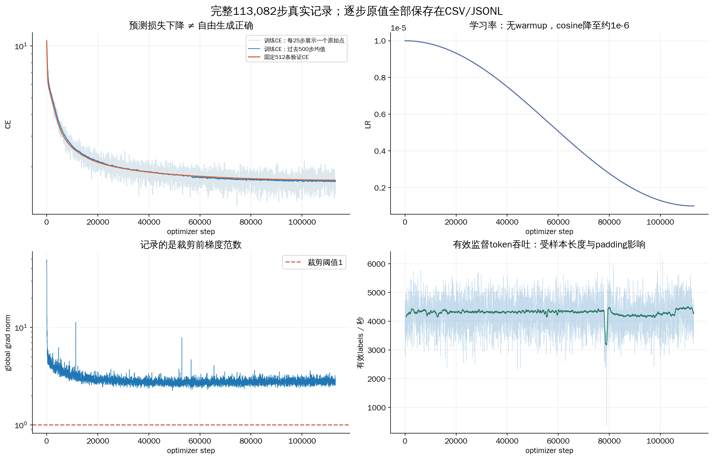
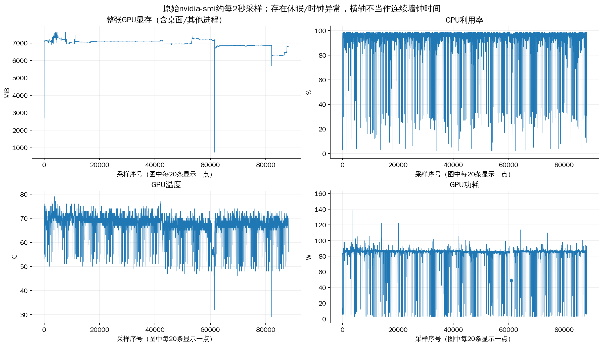

# 06 怎样从日志和曲线判断训练发生了什么

前几章解释了一次计算。本章练习把数万次计算读成有证据的训练过程。目标不是看到一条下降曲线就放心，而是能解释每个数字的单位、采样范围和限制。

## 1. 先分清 step、样本、epoch 和 token

一次 `optimizer.step()` 才算一次参数更新；一次 DataLoader 取批可以只属于某个累积组的一部分。epoch 是训练集遍历一遍，cursor 是这一轮已经消费多少条记录。

本次每轮 904,644 条，B16、累积1：

```text
904644 = 56540×16 + 4
每轮更新次数 = 56541
两轮更新次数 = 113082
```

最后一批只有4条，仍进行了更新，没有丢弃或重复补满。计数必须从实际样本和标签来，不能把每一步都乘16估算。

有效监督 token 是本步 labels 错位后不等于 -100 的个数；它不是输入总格数，也不是字数。所有步的有效目标相加，才是本项目 `tokens_trained`。

## 2. 先读一行真实记录，再看曲线

在自己的仓库根目录运行：

```bash
python -B tools/study_minimind.py replay --step 1
```

它只读历史文件。真实第一步主要数字如下：

| 字段 | 数值 | 逐句解释 |
|---|---:|---|
| step | 1 | 刚完成第一次参数更新 |
| epoch / cursor | 0 / 16 | 第一轮从0编号，已读16条 |
| ce_loss | 10.652998 | 当前这批有效目标的交叉熵 |
| aux_loss | 0.004540 | 八层MoE的辅助损失之和 |
| loss | 10.657538 | 本步CE加aux |
| grad_norm | 45.8114 | 裁剪前全参数梯度范数 |
| learning_rate | 0.00001 | 本次更新实际使用的LR |
| valid_tokens | 7,818 | 本步计入CE的目标数 |
| nominal_tokens | 12,288 | 16×768，包括pad与非监督位置 |
| nonpad_input_tokens | 9,228 | 真实输入，包括问题与模板 |
| step_seconds | 2.14722 | 本次更新计时，不含后续周期评估保存 |

自己做三个计算：

```text
总loss = 10.652998 + 0.004540 ≈ 10.657538
padding比例 = 1 - 9228/12288 ≈ 24.90%
有效目标吞吐 = 7818/2.14722 ≈ 3640.98 个/秒
```

名义位置吞吐约 5722.74 个/秒，比有效目标吞吐高，并不是模型突然更快了，只是分子包含更多占位。比较系统时必须固定口径。

首步包含冷启动影响，也不能拿这一点单独推算全部时间。

## 3. 打开训练图，四块分别怎么看？



**左上看 CE。** 浅色线每25步显示一个原始点，深蓝线是过去500步均值，橙线是固定512条验证结果。平滑只为了看趋势，不会修改原始记录；全部113,082步仍在[CSV](数据表/全部训练更新.csv)和 run 的 metrics.jsonl。

纵轴是对数刻度，相同的视觉高度差表示比例关系，不是同样的 CE 减少量。初期快速下降说明模型对这套目标的预测迅速改善；后期变平只说明每单位训练的改善减缓，不能据此断言已经达到所有任务的最优。

训练点用不同 batch，难度与长度都变；验证用固定样本，更适合观察趋势。某一步训练 CE 上升，不自动等于训练崩坏。这里蓝线与橙线较接近，也不能证明没有数据污染或所有能力都泛化。

**右上看 LR。** 它呈预定 cosine 形状，是 scheduler 的输出，不是模型自己判断何时降低 LR。横轴从0附近到113082，LR从1e-5到接近1e-6。若恢复后突然回到开头，先检查调度 step/总预算。

**左下看梯度范数。** 红线是裁剪阈值1，蓝线在上面不表示裁剪失效，因为画的是裁剪前值。孤立尖峰先对照那一步的数据、有效标签数和固定验证；连续非有限或大幅异常才需要更紧急地定位。

**右下看有效目标吞吐。** 浅色点波动包含样本有效标签数量变化；深线帮助看长期速度。在图上看到一个低谷，只能确认吞吐下降，不能仅凭曲线断言由过热、休眠或数据加载造成。需要到同一时段的原始记录中查证。

## 4. 轮次边界为什么会出现不同数字？

重放：

```bash
python -B tools/study_minimind.py replay --step 56541
python -B tools/study_minimind.py replay --step 56542
python -B tools/study_minimind.py replay --step 113082
```

| step | epoch | cursor | 名义位置 | 累计有效目标 |
|---:|---:|---:|---:|---:|
| 56541 | 0 | 904644 | 3072 | 367916967 |
| 56542 | 1 | 16 | 12288 | 367923613 |
| 113082 | 1 | 904644 | 3072 | 735833934 |

3072=4×768，说明最后一批4条。进入第二轮后 cursor 回到16，但全局step和累计token继续增加。

循环结束后，完整恢复状态保存为 epoch=2、cursor=0。它与最后一条训练日志 epoch=1、cursor=904644 不矛盾：前者表示整个循环已处理完轮次切换，后者是最后一次更新现场。

## 5. 为什么“最新一步 loss”不等于“模型目前水平”？

第12000步的训练CE约2.462，这是当步样本上的值；第113082步约1.600，是另一批只有4条的值。它们可作为进展线索，不能直接组成公平测试。

固定验证CE从转换后约10.7034降到最终1.664181；完整1066条最终CE为1.638091。后一分数换了样本集合，不能把它比1.664181低解释为模型又学习了一次。

replay 返回的是“这步真实记录”和“此前最近保存的评估”。它不会伪造每步的生成结果，也不会恢复一个根本没保存的中间权重。查看评估时先读里面的 step，别把500步保存的回答当作501步刚生成的。

## 6. 系统图要与事件一起读



左上是整张卡显存，单位MiB，含桌面和其他进程；不能与训练器 allocated 直接视为同一指标。右上是GPU利用率，左下温度，右下功耗。

采样约每2秒一次，图上每20条显示一点。横轴是采样序号，不是optimizer step，更不是连续墙钟时间；存在休眠和时钟异常时，不能把横轴间隔直接换算时长。

看到显存阶跃，先对照训练进程启动/退出、验证、保存与其他使用者；看到利用率下降，检查是否取数据、保存文件、同步、功率变化或故障。约2秒采样可能错过短瞬间峰值，不能用它证明从未出现某种显存尖峰。

温度高、功耗高并不自动意味着过热降频。要看到吞吐/频率与温控证据相互对应，才能归因。

## 7. 47.58 小时与 71.52 小时为什么同时成立？

把所有 `step_seconds` 相加，得到约47.5825小时，是记录的更新计算计时。把首末训练记录的墙钟时间相减，跨度约71.5172小时，包含未更新的间隔，还受已记录睡眠与时钟问题影响。

更新计时不包含后面的所有验证、保存、绘图；墙钟间隔也不能全部叫“GPU计算慢”。本次对夜间间隔查过Windows事件，发现睡眠/休眠证据，详见[真实计时诊断](../docs/debug/015_sleep_pause_and_eta.md)。

为了让你自己重算，而不是背这两个结论，运行：

```bash
python -B tools/lesson_examples.py records
```

脚本逐行读取正式metrics，检查step从1连续到113082、有效目标累计735833934，并输出上述两种时间、五个指定更新和非有限记录数。此次 CE/aux/grad 检查到的非有限行数为0；这不等于保证训练所有内部张量从未发生任何数值问题。

## 8. 路由图与状态字段怎样读？

[路由图](../models/02_hybrid_moe/runs/hybrid_sft_official_mini_2ep_v1/plots/routing.png)记录专家选择。`router_first_microbatch_nonpadding` 只代表指定记录步的第一小批、排除pad的统计，并非全训练每步全部token。

某个专家比例高，先描述持续性、层号、输入分布，再查梯度与aux。不能仅用一张路由图把所有回答错误归因到专家失衡。模型内部aux仍包含pad，与这张图的统计口径不同。

状态文件也是证据之一：`training` 是最后发布状态，不保证PID仍在；`complete` 表示此run预算/流程完成；`paused` 表示留下可恢复状态，但是否继续取决于项目决定。本项目普通MoE已被停止，学习脚本不会重新启动它。

## 9. 如果每个中间状态没保存，还能学吗？

本项目保留逐步指标、指定评估、里程碑与最终恢复点，没有为每一步保存全部激活、梯度和模型。那样会产生很大存储与同步开销。

用同源码和完整权重做CPU梯度追踪，可以观察机制，但必须标成事后教学检查，不能伪称当时某一步的完整现场。想研究某个历史step的参数行为，首先确认那个step是否存在实际checkpoint。

<details>
<summary>本章验收：给第12000步写一段解释</summary>

它是第12000次更新，epoch0已消费192000条；本批6126个有效目标，耗时约1.51313秒，约4048.57有效目标/s，LR约9.75228e-6，CE约2.462，aux约0.004208。grad_norm约3.10946是裁剪前；进程峰值allocated约4.50GiB不是本步独立峰值。该步的样本CE与固定验证不能直接互换。

若你能从原始字段自己算出吞吐、解释单位，并指出不能从这一行推断出的结论，才算会读日志。

</details>

下一章：[07 保存与恢复](07_Checkpoint和恢复.md)。
