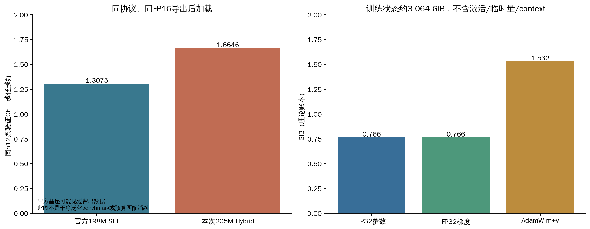

# 08 用证据定位问题

## 本次结果到底怎样

同一512条、191,220目标，官方198M参考CE1.307459，最终Hybrid导出重载CE1.664561；最终FP32训练态同集1.664181，完整1066条1.638091。最后一个分数不能与不同样本集合直接比较。

16题探针包含10个严格格式评分题和6个定性题。双方严格格式均0/10，不能称为“所有能力准确率0%”：回答正确数字却多解释也会失败。完整题目在[evaluation/text_probes_v1.json](../evaluation/text_probes_v1.json)，原始回答与CPU/GPU/输出预算协议在[最终评测报告](../reports/hybrid_final_review_20261006.md)。

最终训练器的3题示例中，17+25被回答为2250；配对长输出题中，Hybrid将144÷12回答为0，偶数求和任务返回偶数列表。官方参考也有错误，但若干任务更接近要求。没有将这些题的答案回填训练，也没有只展示好例子。

## 通用诊断记录模板

每次问题写：现象（含step/时间/shape）→ 初始假设 → 检查方法 → 原始证据路径 → 排除范围 → 根因或未确定 → 修复 → 是否改变算法/数据 → 成本 → 同条件复验 → 以后识别方法。填写模板时必须允许“根因未确定”，不要把猜测写成结论。

## 案例A：loss下降却反复胡说

现象：固定CE持续下降，生成仍循环。假设：缓存错误、GPU推理精度、输出截断、模板/数据、新结构恢复不足。

检查：第12000步CPU同序列full-forward/cache逐位置logits比较；最终CPU/GPU、短输出/至少256token、同提示官方参考、FP16导出重载对照。

证据：CPU cache对照最大relative RMS约6.94e-7、argmax一致；加长输出仍错；CPU FP32也坏；导出CE变化约0.00038。它们降低了某些假设的解释力，但没有完整排除GPU训练数值或数据问题。

结论：转换后能力尚未恢复，唯一根因未确定。未机械加第三轮。接下来应在相同预算下分别检验适应方案、门初始化、数据分布等，而不是同时全改后无法归因。[完整debug013](../docs/debug/013_hybrid_transfer_recovery.md)

## 案例B：OOM不只有“batch太大”

Omni在明确5.3GiB allocator预算下，B1T512默认布局第一次分配AdamW moment失败；同条件expandable segments通过。T1536时活跃张量本身接近预算，单改allocator不够，重计算减少activation后通过。再测试累积2又失败，因为已有gradient与下一批activation叠加。

通过moment offload候选定位并减轻这一峰值，随后检查参数/optimizer数值一致性；代价是主存和传输。这里的OOM是当时配置和预算内的事实，不是物理8GB卡绝对不能运行所有Omni任务。[完整debug004](../docs/debug/004_omni_memory.md)

快速路径：失败在forward/backward/optimizer哪一段 → 活跃/保留/外部占用 → 参数/grad/moments/activation分账 → 一次只改一个条件 → 同样本跨多个更新再测。`empty_cache()`不会释放仍被引用的活跃张量。

## 案例C：输出接近，梯度却错很多

Hybrid精度候选前向接近，衰减门梯度差异很大。进一步发现最早使用的FP32参考也受默认Triton TF32 dot精度影响；建立独立递推参考后，IEEE/TF32x3通过，BF16投影候选仍有约7%–9.5%门梯度差异，未通过原3%门槛，因此未采用。

学习点：不能只比logits或总loss，敏感小模块梯度也要检查；参考实现本身需要可信。PyTorch TF32和Triton dot设置分开。[debug007](../docs/debug/007_hybrid_bf16_gradient.md)

## 案例D：十小时没日志，是训练卡死吗

两次夜间出现巨大墙钟间隔，但perf_counter记录的实际更新耗时仍是秒级，Windows事件记录睡眠/休眠。防睡眠API旧脚本没有核查返回值，后来改为同原生线程重复请求并保存心跳。此修复不保证阻止合盖、主动睡眠或电池保护。

检查PID、GPU、最后日志、完整checkpoint、主机事件与计时口径；不要看到日志停了就重复启动第二个训练。[debug015](../docs/debug/015_sleep_pause_and_eta.md)

## 案例E：WSL的worker报IPC错误

DataLoader多进程需要Unix socket；把TMPDIR放到Windows挂载盘导致失败。修复是Linux临时目录，数据和交付继续在D盘；这不意味着要把整个项目搬走。[debug002](../docs/debug/002_wsl_dataloader_socket.md)

## NaN与loss spike应如何排查

正式Hybrid记录没有非有限CE/aux/grad事件，不编造一次“正式NaN事故”。实际dLM合同检查存在零监督等边界反例，范围见[debug与dLM说明](../models/05_dlm/README.md)。

若以后NaN：先保留失败样本、config、最近完整状态；检查labels是否全忽略、token是否越界、mask是否全遮挡、输入/参数/激活/梯度首次非有限位置，再检查精度与LR。不要先覆写失败checkpoint。loss spike先看同一步样本长度/内容、有效标签数、路由和grad，再看固定验证是否持续恶化。偶发困难batch与训练崩坏不是同一判断。

练习：用本章模板写“为什么Hybrid没追平基座”，至少列出两个仍未排除的原因与一个已经做过、但范围有限的排除检查。
